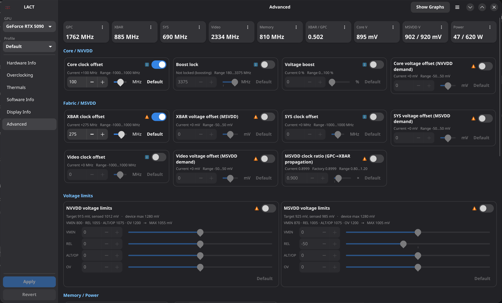
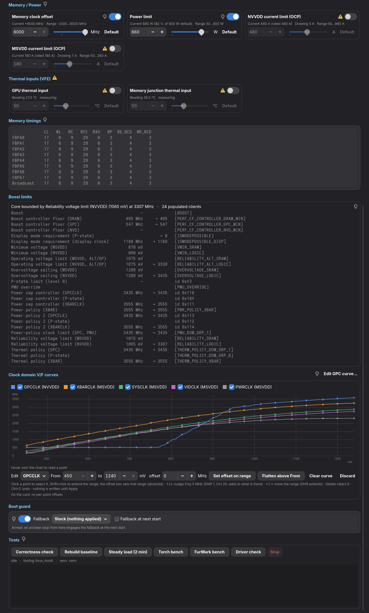

# Linux GPU Control Application
<a href="https://translate.fedoraproject.org/engage/lact/">

</a>


This application allows you to control your AMD, Nvidia or Intel GPU on a Linux
system.

> **This fork** adds an **Advanced** page for NVIDIA GPUs: the fabric (XBAR)
> clock, per-domain voltage demand, the voltage-rail policy limits, the
> GPC→XBAR propagation ratio, live rail and ADC voltages, and the driver's
> boost-limit clients — the controls the Windows tuning tools reach through
> private NvAPI, done on Linux through the driver's own RM interface. It is
> developed and verified on an RTX 5090 (GB202) with driver branches R610 and
> R615. Everything else is upstream LACT. [Jump to the fork section.](#the-advanced-page-this-fork)


| GPU info                          | Overclocking                      | Fan control                       |
| ----------------------------------| ----------------------------------| ----------------------------------|
|  |  |  |
| Software info                     | Historical data                   |                                   |
|  |  |                                   |

### Features:

- #### Detailed GPU information reporting
  - Name and manufacturer
  - VBIOS info
  - VRAM info (Type/Manufacturer/Bus)
  - Hardware unit info (CUs/SMs/EUs, ROP count)
  - Resizable BAR status
  - Vulkan features and extensions
- #### Monitoring
  - Configurable historical charts for power/thermals/frequency
  - Throttling info
  - Data CSV export
- #### Power configuration
  - Power cap
  - Power states (AMD only)
- #### Thermals configuration
  - Custom fan curves (AMD/Nvidia)
  - GPU firmware thermal options such as thermal and acoustic target/limit (AMD RDNA3+ only)
- #### Overclocking
  - GPU/VRAM clocks configuration
  - GPU undervolting (via voltage offset on AMD, VF curve on Nvidia)
- #### Settings profiles
  - Automatic profile activation based on running processes or gamemode status
- #### [OpenTelemetry metrics exporter](./docs/EXPORTER.md)

GPU configuration is handled by a system service that does not depend on a graphical session (Wayland/X11).

The service can also be used standalone with a config file, for example in headless scenarios.


# The Advanced page (this fork)

One page, laid out after mVolt+, for everything that tunes an NVIDIA
Blackwell card: the NVML-backed controls the Overclocking page also has
(core and memory offset, power limit, voltage boost, locked core clock) plus
the ones only this page reaches.

| Telemetry, clock and voltage cards, rail limits | Memory and power, boost limits, tests |
| --- | --- |
|  |  |

## What the page controls

| Card | What it does | Mechanism |
| --- | --- | --- |
| XBAR / SYS / video clock offset | Frequency offset of the crossbar, system and video clock domains, the ones NVML does not expose. Driver range ±1000 MHz. | RM `CLK_DOMAINS` control block, readback-verified |
| Core / XBAR / SYS / video voltage offset | Each domain's *voltage demand* on its own rail (NVVDD for the core, MSVDD for the fabric domains). The arbiter grants the highest demand on the rail, so these nudge rather than set. ±50 mV. | Same control block, rail slot from the driver's own rail mask |
| NVVDD / MSVDD voltage limits | The four policy limits of each rail as deltas: VMIN, REL (reliability, normally the binding maximum), ALT/OP (operating), OV (overvoltage ceiling). ±250 mV, held under the voltage device's maximum. | RM `VOLT_RAILS` control object |
| NVVDD / MSVDD current limit (OCP) | Each rail's current limit in the driver's power policies, amps (rated 480 A / 180 A on the reference card). Neither binds at the stock power limit; lowering the NVVDD one caps the core rail on its own. Off = the value found at daemon start; 50 A … 2× rated. | RM `PWR_POLICIES` control object, TGP entry cross-checked against NVML |
| MSVDD clock ratio | The GPC→XBAR clock-propagation ratio of the active clock topology (factory 0.9 on GB202). A ceiling, not a formula. 0.80–1.20. | RM `CLK_PROP_TOP_RELS` |
| Telemetry tiles | Measured GPC, XBAR, SYS, video and memory clocks, XBAR/GPC ratio, core and MSVDD voltage, power, and each rail's current with the power it implies. Click a tile to graph it. | RM `CLK_MEASURE_FREQ`, rail status, on-chip ADCs, power-policy status |
| Boost limits | Every populated limit client of the driver's clock arbiter with NVIDIA's own name, its value and the clock it produces, and which one bounds the core. | RM `PERF_LIMITS` status, names from NVML's table |
| Tests | Runs the companion tooling from the page: a correctness harness at the applied setting, a baseline rebuild, a steady load, a post-driver-update check. | Subprocesses, log tailed into the pane |

## How it works

The controls go through NVIDIA's private RM control objects over
`/dev/nvidiactl`, the same path the daemon already uses for other queries,
with command IDs and parameter sizes recovered from the size table inside
`libnvidia-api.so` and record layouts established on the card. Nothing here
is in a public header, so the daemon treats every object defensively:

- **Per-branch gate.** The clock-domain interface is only enabled on driver
  branches its layout has been verified against (R610 and R615). On any
  other branch the page shows why, and offsets left in the config are
  skipped with a warning rather than blocking the rest of the profile.
- **Self-checks before use.** Every object is probed at daemon start: entry
  tags, object types, rail counts, record indices. Anything unexpected
  disables that one feature.
- **Domains by identity, not index.** Clock domains are resolved by their
  `apiDomain` selector and the propagation relation by its properties,
  because the index→domain map is not an identity on this hardware.
- **Every write is read back.** A successful status alone is never trusted;
  the ratio setter restores the previous object on a mismatch, and reset
  returns every object to what the daemon found at start.
- **Nothing here detects wrong answers.** An XBAR offset can read back
  correctly, never crash, and still corrupt computation (+340 MHz on the
  reference card did exactly that). The correctness check in the Tests
  section is the guard, and the card notes carry what it found.

Offsets live in LACT's normal config, are applied at daemon start, and are
covered by the confirm-or-revert timer like any other setting.

## What the measurements said (RTX 5090, torch workloads)

- XBAR +250 is bit-exact under a crossbar-heavy harness and is the daily
  setting; +300 passed; **+340 and +380 silently corrupt** with no crash and
  no Xid; +450 hard-locks the machine.
- Neither the MSVDD demand offset (+20 mV) nor the MSVDD REL limit (+30 mV,
  which really did raise the loaded rail target from 995 to 1030 mV) rescued
  +340. On this card the fabric clock's correctness ceiling is not a voltage
  margin at ~1 V.
- The propagation ratio is a ceiling: 0.80 pulled XBAR down ~180 MHz
  immediately and reversibly; raising it did nothing while the offset and
  V/F curve were the binding constraint.
- Under a power cap the core is held by the driver's power-policy controller
  (clients 0x110/0x111), which the page reports through NVML's throttle
  reason; otherwise the reliability voltage limit (1055 mV → 3217 MHz) is
  what bounds the core.

Details, layouts and the full record are in
[docs/ADVANCED_PAGE.md](docs/ADVANCED_PAGE.md).

## Building and installing this fork

Same as upstream (see *Building from source* below), then
`sudo sh install_fork.sh` installs under `/usr/local` and enables `lactd`.
The Tests section expects the companion tooling directory (harness, loads,
probes) at `~/claude_workspace/linux_mvolt` or `$LACT_ADV_TOOLS_DIR`; without
it the buttons are greyed out and everything else works.

## Credits and caveats

The XBAR clock control was discovered by
[Loong0x00](https://github.com/Loong0x00) (LACT issue #1147, whose LACT
branch also established the propagation-ratio layout);
[SHANAjam](https://github.com/SHANAjam/rtx5090-xbar-control) published the
NvAPI side; [b00nz's mVolt+](https://github.com/b00nz/mVolt) set the
interface model and vocabulary; upstream PR #1158 by Panchovix implements
the domain offsets independently. Everything on this page writes
undocumented GPU state; it can crash, hard-lock or silently miscompute, and
it is only as verified as the notes say. Use it with a correctness check,
not a benchmark.

# Quick links

- [Installation](#installation)
- [Hardware support](https://github.com/ilya-zlobintsev/LACT/wiki/Hardware-Support)
- [Frequently asked questions](https://github.com/ilya-zlobintsev/LACT/wiki/Frequently-asked-questions)
- [Enable overclocking on AMD](https://github.com/ilya-zlobintsev/LACT/wiki/Overclocking-(AMD))
- [Config file reference](./docs/CONFIG.md)
- [API](./docs/API.md)
- [Power profiles daemon note](#power-profiles-daemon-note)
- [Recovery from a bad overclock](https://github.com/ilya-zlobintsev/LACT/wiki/Recovering-from-a-bad-overclock)
- [Metrics exporter](./docs/EXPORTER.md)
- [Contribute code](./docs/CONTRIBUTING.md)
- [Contribute translations](#localization)
- [Support the project](#support-the-project)

# Installation

- Arch Linux: Install the package from official repositories: `pacman -S lact`
  (or `lact-git` from AUR for development builds).
- Debian/Ubuntu/Derivatives: Download a .deb from
  [releases](https://github.com/ilya-zlobintsev/LACT/releases/).

  It is only available on Debian 12+ and Ubuntu 22.04+ as older versions don't
  ship gtk4.
- Fedora: use the
  [Copr repository](https://copr.fedorainfracloud.org/coprs/ilyaz/LACT/), or
  download an RPM from
  [releases](https://github.com/ilya-zlobintsev/LACT/releases/).
- Bazzite/Fedora Atomic: Use the Flatpak.
- Gentoo: Available in
  [GURU](https://github.com/gentoo/guru/tree/master/sys-apps/lact).
- OpenSUSE: an RPM is available in
  [releases](https://github.com/ilya-zlobintsev/LACT/releases/).

  Only tumbleweed is supported as leap does not have the required dependencies
  in the repos.
- NixOS: There is a package available in
  [nixpkgs](https://search.nixos.org/packages?channel=unstable&from=0&size=50&sort=relevance&type=packages&query=lact).
- Solus: Available in the offical repository: `eopkg it lact`
- Flatpak (universal): Available on [Flathub](https://flathub.org/apps/io.github.ilya_zlobintsev.LACT) and in [releases](https://github.com/ilya-zlobintsev/LACT/releases/).

  See the [Flatpak documentation](./flatpak/README.md) for additional notes.
- Docker (service only, no GUI): See [DOCKER.md](./docs/DOCKER.md)
- Build from source.

Note: Nvidia support requires the Nvidia proprietary driver with CUDA libraries
installed.

## Development builds

To get latest fixes or features that have not yet been released in a stable
version, there are packages built from the latest commit that you can install
from the
[test release](https://github.com/ilya-zlobintsev/LACT/releases/tag/test-build)
or using the `lact-git` AUR package on Arch-based distros.

Note: the date that GitHub shows next to the test release is not when the packages were built,
the actual date is specified next to the attached package files.

# Usage

Enable and start the service (otherwise you won't be able to change any
settings):

```
sudo systemctl enable --now lactd
```

You can now use the GUI to change settings and view information.

# Hardware support

See the
[Wiki page](https://github.com/ilya-zlobintsev/LACT/wiki/Hardware-Support)

# Configuration

There is a configuration file available in `/etc/lact/config.yaml`. Most of the
settings are accessible through the GUI, but some of them may be useful to be
edited manually (like `admin_group` and `admin_user` to specify who has access
to the daemon)

See [CONFIG.md](./docs/CONFIG.md) for more information.

**Socket permissions setup:**

By default, LACT uses either ether the `wheel` or `sudo` group (whichever is
available) for the ownership of the unix socket that the GUI needs to connect
to.

On most desktop configurations (such as the default setup on Arch-based, most
Debian-based or Fedora systems) this includes the default user, so you do not
need to configure this.

This is not needed if you are using the Flatpak, the flatpak service setup handles permissions.

However, some systems may have different user configuration. In particular, this
has been reported to be a problem on OpenSUSE.

To fix socket permissions in such configurations, edit `/etc/lact/config.yaml`
and under the `daemon` section either:

- Set `admin_user` to your username
- Set `admin_group` to a group that your user is a part of, then restart the
  service (`sudo systemctl restart lactd`).

# Overclocking (AMD)

Some functionality requires enabling an option in the amdgpu driver, see the
[wiki page](https://github.com/ilya-zlobintsev/LACT/wiki/Overclocking-(AMD)) for
more information.

## Power profiles daemon note!

If you are using `power-profiles-daemon` (which is installed by default on many
distributions), by default it may override the amdgpu performance level setting
according to its own profile.

When using LACT 0.7.5+ and power-profiles-daemon 0.30+, LACT will try to connect to power-profiles-daemon 
and automatically disable the conflicting amdgpu action in ppd to avoid this conflict.

If running older versions, you can resolve this manually by creating a file at
`/etc/systemd/system/power-profiles-daemon.service.d/override.conf` with the
following contents:

```
[Service]
ExecStart=
ExecStart=/usr/libexec/power-profiles-daemon --block-action=amdgpu_dpm
```

Note: the `/usr/libexec` path might be different on your system, check it in
`systemctl status power-profiles-daemon`

See https://github.com/ilya-zlobintsev/LACT/issues/370 for more information.

# Suspend/Resume

As some of the GPU settings may get reset when suspending the system, LACT will
reload them on system resume. This may not work on distributions which don't use
systemd, as it relies on the `org.freedesktop.login2` DBus interface.

# Building from source

Dependencies:

- rust 1.97+
- gtk 4.14+
- libadwaita 1.5+
- git
- pkg-config
- clang
- make
- hwdata
- libdrm
- libdisplay-info

Optional Dependencies:
- vulkan-tools
- clinfo

Command to install all dependencies:

- Fedora:
  `sudo dnf install rust cargo make git clang gtk4-devel libadwaita-devel libdrm-devel vulkan-tools libdisplay-info-devel clinfo`
- Arch:
  `sudo pacman -S --needed base-devel git clang make rust gtk4 libadwaita hwdata vulkan-tools clinfo libdisplay-info`

Steps:

- `git clone https://github.com/ilya-zlobintsev/LACT && cd LACT`
- `make`
- `sudo make install`

It's possible to change which features LACT gets built with. To do so, replace
the `make` command with the following variation:

Headless build with no GUI:

```
make build-release-headless
```

# Remote management

It's possible to have the LACT daemon running on one machine, and then manage it
remotely from another.

This is disabled by default, as the TCP connection **does not have any
authentication or encryption mechanism!** Make sure to only use it in trusted
networks and/or set up appropriate firewall rules.

To enable it, edit `/etc/lact/config.yaml` and add `tcp_listen_address` with
your desired address and in the `daemon` section.

Example:

```yaml
daemon:
  tcp_listen_address: 0.0.0.0:12853
  log_level: info
  admin_group: wheel
  disable_clocks_cleanup: false
```

After this restart the service (`sudo systemctl restart lactd`).

To connect to a remote instance with the GUI, run it with
`lact gui --tcp-address 192.168.1.10:12853`.

# CLI

There is also a cli available.

- List system GPUs:

  `lact cli list-gpus`

  Example output:

  ```
  0: 10DE:2704-1462:5110-0000:09:00.0 (GeForce RTX 4080) [Dedicated]
  ```
- Getting GPU information:

  `lact cli info`

  Example output:

  ```
  $ lact cli info
  GPU 10DE:2704-1462:5110-0000:09:00.0:
  =====================================
  GPU Model: GeForce RTX 4080 (0x10DE:0x2704)
  Card Manufacturer: Micro-Star International Co., Ltd. [MSI] (0x1462)
  Card Model: Unknown (0x5110)
  Driver Used: nvidia 570.124.04
  VBIOS Version: 95.03.1E.00.60
  VRAM Size: 16376 MiB
  GPU Family: Ada
  Cuda Cores: 9728
  SM Count: 76
  ROP Count: 112 (14 * 8)
  VRAM Type: GDDR6x
  VRAM Manufacturer: Micron
  L2 Cache: 65536 KiB
  Resizeable bar: Enabled
  CPU Accessible VRAM: 16384
  Link Speed: 8 GT/s PCIe gen 3 x8
  ```

- Profiles
  `lact cli profile [COMMAND]`

  - List profiles:

    `lact cli profile list`

    Example output:

    ```
    Default
    Gaming
    Performance
    Balanced
    ```

  - Get current Profile:

    `lact cli profile get` or `lact cli profile`

    Example output:

    ```
    Gaming
    ```

  - Set Profile:

    `lact cli profile set "Performance"`

    Example output:

    ```
    Performance
    ```

    - Auto switch profiles
      `lact cli profile auto-switch [COMMAND]`

        - Get auto-switch state:

          `lact cli profile auto-switch get` or `lact cli profile auto-switch`

          Example output:

          ```
          enabled
          ```

        - Enable auto switch:

          `lact cli profile auto-switch enable`

          Example output:

          ```
          enabled
          ```

        - Disable auto switch:

          `lact cli profile auto-switch disable`

          Example output:

          ```
          disabled
          ```

  - Detach GPU (makes LACT temporarily ignore it):

    ```
    lact cli --gpu-id=10DE:2704-1462:5110-0000:01:00.0 detach
    ```

  - Reattach GPU:
  
    ```
    lact cli --gpu-id=10DE:2704-1462:5110-0000:01:00.0 reattach
    ```

Note that not all functionality is exposed through the CLI. If you want to integrate LACT
with some application/script, you can use the [API](./docs/API.md) instead.

# Reporting issues

When reporting issues, please include your system info and GPU model.

If you're having an issue with changing the GPU's configuration, it's highly
recommended to include a debug snapshot in the bug report. You can generate one
using the option in the dropdown menu:


The snapshot is an archive which includes the SysFS that LACT uses to interact
with the GPU.

If there's a crash, run `lact gui` from the command line to get GUI logs, check
daemon logs in `journalctl -u lactd` for errors, and see `dmesg` for kernel logs
that might include information about driver and system issues.

# Localization

You can contribute translations to LACT using [Weblate](https://translate.fedoraproject.org/engage/lact/).

# Support the project

If you wish to support the project, you can do so via Patreon:
https://www.patreon.com/IlyaZlobintsev

Or using cryptocurrency:
- BTC: `12FuTXZzd5peGb7QfoRkXaLnbJ1DNVW4pP`
- ETH: `0x80875173316aa6317641bfbc50644e7ca74d6b6d`
- XMR: `42E93NZXM7STBUsnMRGNyxKryFVgpHKNP6aza94C5hn17j2W7zUnFHe7ASQzB3KorYYnsaVzWUyHHVYfcTLQRtB63qkv5jE`

# Other tools

Here's a list of other useful tools for AMD GPUs on Linux:

- [CoreCtrl](https://gitlab.com/corectrl/corectrl) - direct alternative to LACT,
  provides similar functionality in addition to CPU configuration with a Qt UI
- [amdgpu_top](https://github.com/Umio-Yasuno/amdgpu_top) - tool for detailed
  real-time statistics on AMD GPUs
- [Tuxclocker](https://github.com/Lurkki14/tuxclocker) - Qt overclocking tool,
  has support for AMD GPUs
